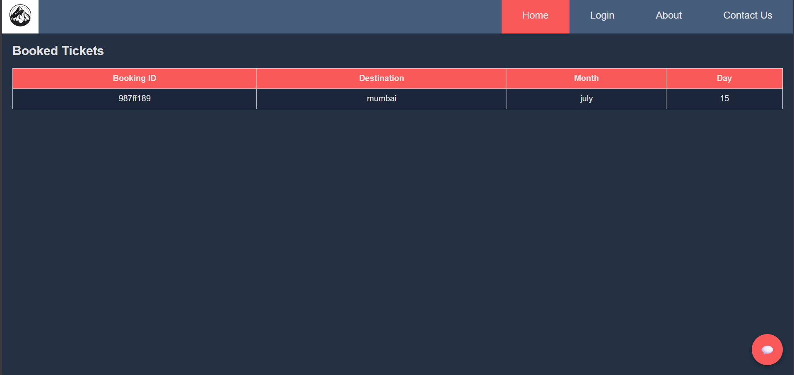
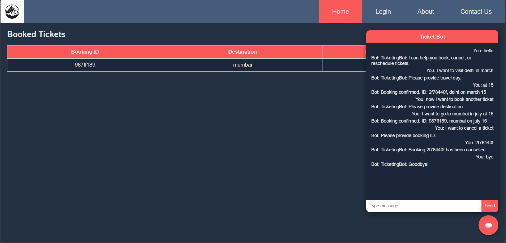

# TicketingBot - GenAI Workshop Learning

A simple intent-based chatbot application that allows users to book, reschedule, and cancel travel tickets. This project demonstrates basic conversational flows, entity extraction, and state management using Python.

## Features

- **Book a Ticket**: Automatically extracts destination, month, and day for travel booking.
- **Cancel a Booking**: Delete an existing booking using the generated Booking ID.
- **Reschedule Date**: Update the travel dates of an existing booking.
- **Two Interfaces**: Choose to run the bot in the terminal or use a web-based chat UI.

## Tech Stack

- **Backend**: Python, FastAPI
- **Frontend**: HTML, CSS, Vanilla JavaScript

## Project Structure

- `app.py`: The FastAPI server containing the chatbot endpoints and in-memory database.
- `chatbot.py`: A CLI (Command Line Interface) version of the TicketingBot.
- `index.html`, `style.css`, `script.js`: The frontend web application featuring a chat interface and active bookings table.
- `requirements.txt`: Python package dependencies.

## Installation & Setup

1. **Clone the repository:**
   ```bash
   git clone https://github.com/AkshatYadav-bit/GenAI_workshop_learning.git
   cd GenAI_workshop_learning
   ```

2. **Install the dependencies:**
   Ensure you have Python installed, then run:
   ```bash
   pip install -r requirements.txt
   ```

## Usage

### 1. Web Application (FastAPI + HTML)
To run the web version of the chatbot with the frontend UI:

1. **Start the FastAPI backend:**
   ```bash
   uvicorn app:app --reload
   ```
   *(By default, this will run on `http://127.0.0.1:8000`)*

2. **Open the frontend:**
   Simply double-click on the `index.html` file to open it in your web browser. You can view your bookings in the table and interact with the TicketingBot by clicking the 💬 icon.

### 2. CLI Chatbot
If you prefer running the bot directly in your terminal:
```bash
python chatbot.py
```

## Video Demo

[Watch the project demonstration video here](https://drive.google.com/file/d/1gwdJUzRNbsv6mzhI8yz5jZBXlm8C7oDg/view?usp=sharing)

## Screenshots


